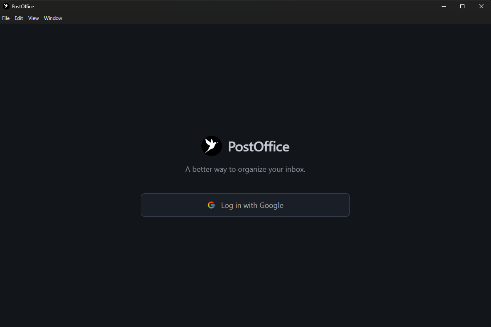
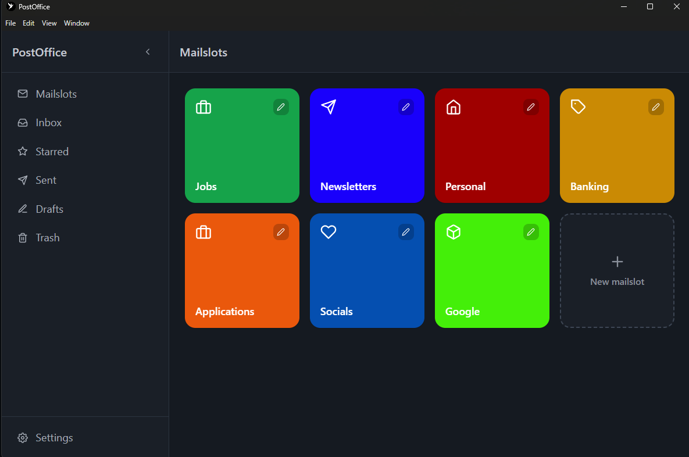
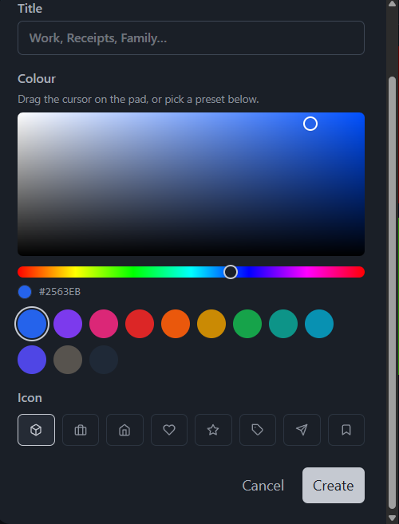
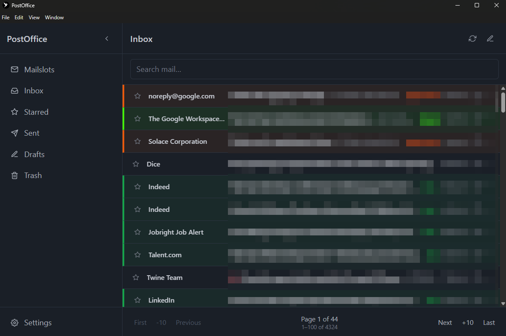
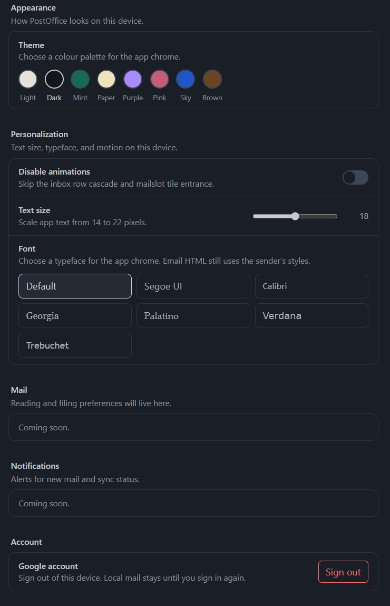

# What is PostOffice

PostOffice is a desktop mail client made with Electron that lets users filter email into custom mailboxes called **mailslots**. It was developed with an AI-assisted workflow in Cursor.

PostOffice was developed with the intention of giving users a more customizable interface to receive, organize, and send mail, all bundled into a convenient desktop app.
Leveraging my experience in TypeScript, JavaScript, and React, I chose to use Electron for this project so I would be able to create a desktop application using my web development skills.

PostOffice uses Google's OAuth 2.0 to sign-in and receive permissions to access the users Gmail account, and performs a full-sync; Storing all user emails in a local SQLite database for fast retrieval and to ignore repeating large and expensive batch requests.

PostOffice is still under development, and will be released using Electron builder and maintained with Electron updater.

## Screenshots

  

<em>Sign-in uses Google OAuth 2.0.</em>

---

  

<em>Mailslots are custom mailboxes, each with its own color.</em>

---

  

<em>Pick any RGB color and an icon when you create one.</em>

---

  

<em>Inbox mail is fetched from Gmail, ordered by arrival, and color-coded by mailslot. Open a mailslot to see only that mail.</em>

---

  

<em>Themes, typography, and other preferences.</em>

## Tech Used

  

